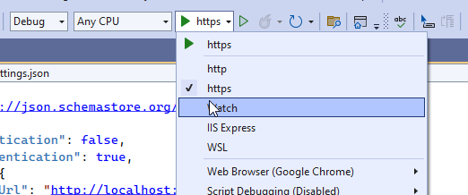
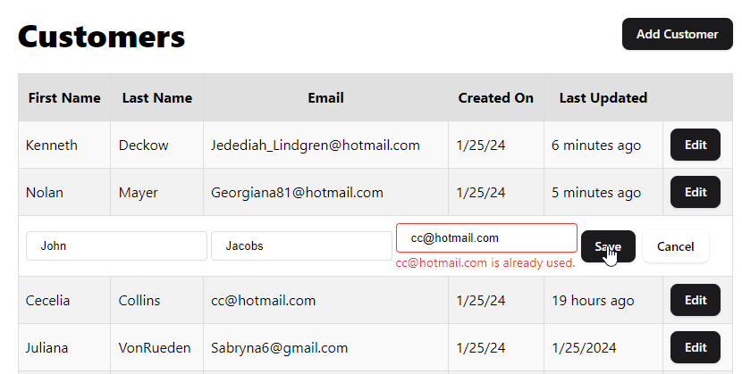
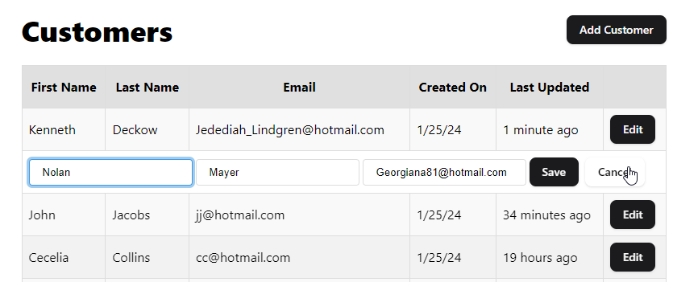
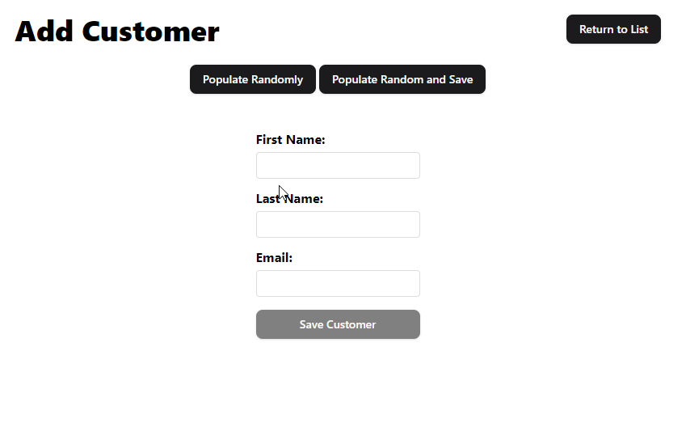
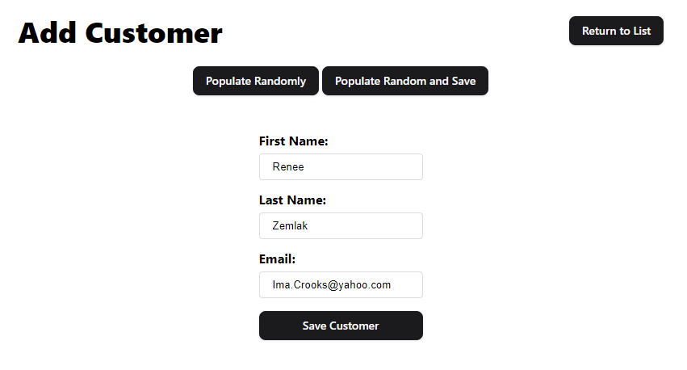
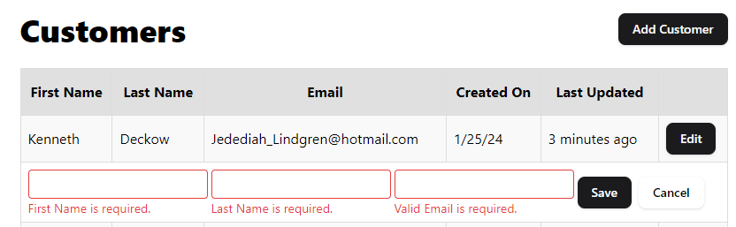
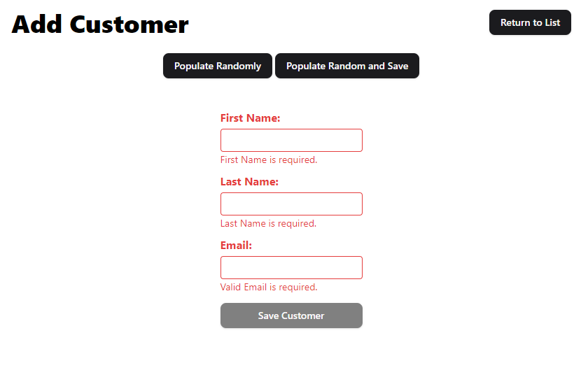
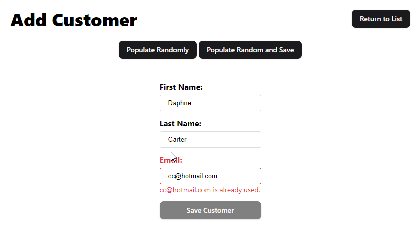
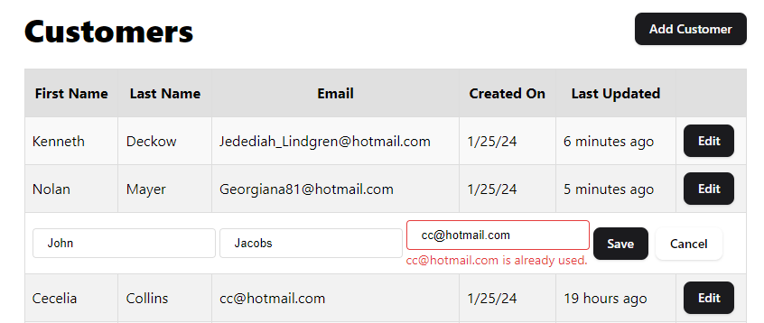

# Getting Started

Open the Solution in Visual Studio (coding-challenge.sln)

Open the `/Client` folder in Visual Studio Code

In VS Code run:

```bash
npm i
npm run start
```

In Visual Studio use the 'Watch' profile to run .Net Core



The default launch URL is the swagger endpoint.
http://localhost:5248/swagger/index.html

To see the client navigate to
http://localhost:5248/

Customer List


Editing Customers


Adding Customers



Validation Client Side



Validation Server Side

